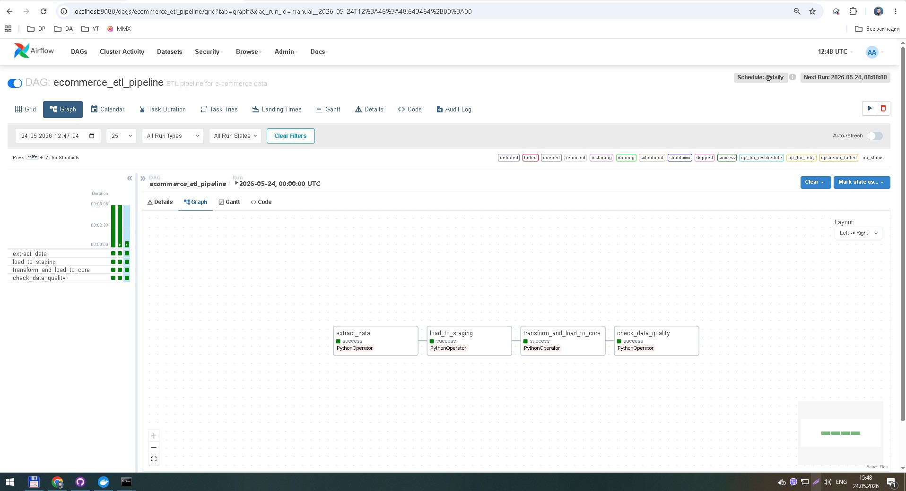
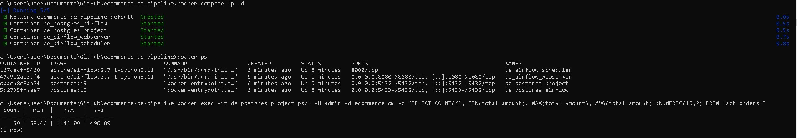

# 🏗️ End-to-End E-commerce Data Pipeline

> Автоматизированный ETL-пайплайн для обработки данных электронной коммерции.  
> Демонстрирует навыки оркестрации, контейнеризации, моделирования данных и Data Quality.

## 🎯 Цель проекта
Построить воспроизводимый конвейер, который ежедневно извлекает данные, очищает их, трансформирует в витрины (Star Schema) и валидирует качество перед загрузкой в аналитическое хранилище.

## 🛠️ Стек технологий
*   **Orchestration**: Apache Airflow
*   **Storage**: PostgreSQL
*   **Processing**: Python (Pandas), SQL
*   **Infrastructure**: Docker, Docker Compose
*   **Concepts**: ETL, Data Modeling (Star Schema), Data Quality Checks, Idempotency

## 🏗️ Архитектура
📥 Source → 📦 Staging (Raw) → 🔄 Transform (SQL Aggregation) → 📊 Core (Fact/Dim) → 🔍 Quality Check
1. **Extract**: Генерация/загрузка сырых данных
2. **Load to Staging**: Идемпотентная загрузка (`TRUNCATE` → `INSERT`)
3. **Transform & Load to Core**: Агрегация заказов, расчёт `total_amount`, upsert в `fact_orders`
4. **Data Quality Check**: Валидация `total_amount` на `NULL`/отрицательные значения

## 📊 Результат запуска
**Граф выполнения DAG (4 задачи, 0 ошибок):**  


**Данные в PostgreSQL после трансформации:**  


## 🚀 Как запустить локально
```bash
# 1. Клонируй репозиторий
git clone https://github.com/z10n/ecommerce-de-pipeline.git
cd ecommerce-de-pipeline

# 2. Запусти инфраструктуру
docker-compose up -d

# 3. Открой Airflow UI
http://localhost:8080
# Логин: admin / Пароль: admin

# 4. Настрой подключение к БД в Airflow
Admin → Connections → + 
Id: postgres_default | Host: postgres-project | Schema: ecommerce_dw | Login: admin | Password: secret | Port: 5432

# 5. Запусти DAG
Включи тумблер → Trigger DAG

💡 Чему научился
* Настройка Airflow в Docker с разделением служебной и проектной БД
* Проектирование идемпотентных задач (безопасный перезапуск)
* SQL-трансформации: GROUP BY, ON CONFLICT DO UPDATE, агрегации
* Внедрение Data Quality Checks как этапа пайплайна
* Управление зависимостями через Docker Compose
🔗 GitHub https://github.com/z10n/ecommerce-de-pipeline.git